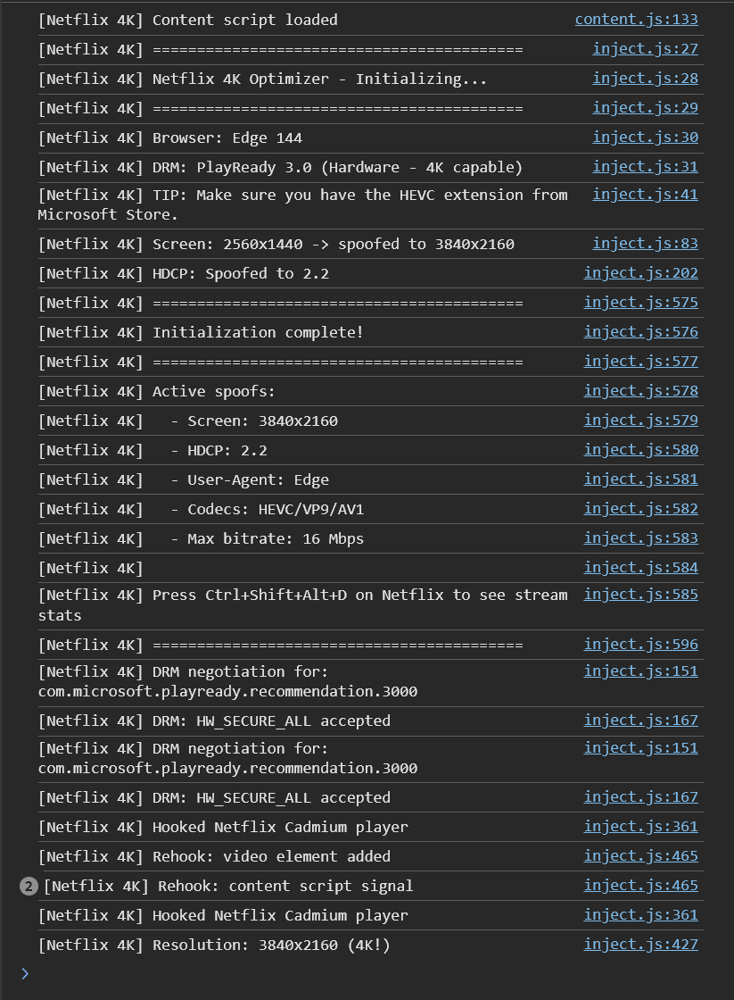

# Netflix 4K

A browser extension that fixes Netflix's broken capability detection. If your hardware can do 4K but Netflix disagrees, this might help.

## Why I Built This

I have a 4K monitor. I pay for Netflix Premium. I wanted to watch in 4K. Simple, right?

Wrong.

First, Netflix said I needed a specific browser. Fine, I downloaded Edge. Still 1080p.

Then they said I needed HDCP 2.2. My DisplayPort cable might have issues, so I bought an HDMI 2.1 cable. Still 1080p.

Then I needed Dolby Atmos. Got that too. Still. Freaking. 1080p.

I did everything Netflix asked. My hardware was capable. But Netflix's detection kept saying "nope."

So I built this extension. And it worked.

## What It Actually Does

Netflix checks if your setup can handle 4K through JavaScript APIs — screen resolution, HDCP status, codec support, DRM capabilities. Sometimes these checks fail incorrectly, even when your hardware is perfectly capable.

This extension spoofs those checks to report 4K capability, letting Netflix serve you the stream your hardware can actually play.

### What Gets Spoofed

| Check | Spoofed Value |
|-------|---------------|
| Screen resolution | 3840x2160 |
| HDCP version | 2.2 |
| User-Agent | Microsoft Edge |
| Media Capabilities | HEVC/VP9/AV1 supported |
| DRM robustness | HW_SECURE_ALL |
| Max bitrate | 16 Mbps |

## Requirements

Before you get excited, here's what you actually need. No extension can bypass these.

### Browser

**Microsoft Edge on Windows.** That's it. Chrome, Firefox, Brave — none of them work for 4K Netflix.

Here's the thing most articles get wrong: it's not about "Widevine L1 vs L3." Edge doesn't even use Widevine for Netflix. It uses **PlayReady**, Microsoft's DRM that hooks into Windows at the hardware level.

| Browser | DRM System | Max Quality |
|---------|------------|-------------|
| Edge | PlayReady 3.0 | 4K |
| Chrome | Widevine L3 | 1080p |
| Firefox | Widevine L3 | 1080p |
| Brave | Widevine L3 | 1080p |

Chrome literally cannot access PlayReady. It's not a detection problem — the DRM Netflix requires for 4K doesn't exist in Chrome. No extension can fix that.

### Hardware

- **CPU**: Intel 7th gen (Kaby Lake, 2017) or newer, or AMD Ryzen
- **GPU**: NVIDIA GTX 1050+ or AMD RX 400+ with PlayReady 3.0 support
- **Display**: 4K resolution, 60Hz+
- **Cable**: HDMI 2.0+ or DisplayPort 1.3+ for HDCP 2.2

Why Kaby Lake specifically? Netflix 4K uses 10-bit HEVC. Kaby Lake was the first Intel architecture with hardware 10-bit HEVC decoding. Older CPUs can only do 8-bit in hardware, and software decode can't meet real-time demands at 4K bitrates.

### Software

- **Windows 10** (Anniversary Update+) or **Windows 11**
- **HEVC Video Extension** from Microsoft Store — [$0.99](https://apps.microsoft.com/store/detail/hevc-video-extensions/9NMZLZ57R3T7)
- **Hardware acceleration ON** in Edge (`edge://settings/system`)
- **Latest GPU drivers**

That HEVC extension is easy to miss. Used to come with Windows, now it's a separate purchase. Netflix won't serve you 4K HEVC without it.

### Netflix

- **Premium plan** — 4K requires the top tier

## Who This Helps

This extension is for you if:

- You meet all the requirements above but Netflix still caps you at 1080p
- You have HDCP detection issues (DisplayPort adapters, KVM switches, capture cards)
- You use external monitors where Netflix misdetects capabilities
- You have a multi-monitor setup with detection problems
- Netflix used to work in 4K but suddenly stopped

Basically: your hardware is capable, but Netflix's JavaScript checks are returning false negatives.

## Who This Won't Help

- **Chrome/Firefox users** — no PlayReady, no 4K, period
- **Pre-Kaby Lake CPUs** — no hardware 10-bit HEVC
- **Missing HEVC extension** — install it from Microsoft Store
- **AMD GPU blacklist victims** — some RX 6000/7000 cards are blacklisted by Chromium (workaround below)

## Installation

### 1. Download

```bash
git clone https://github.com/Pickle-Pixel/netflix-force-4k.git
```

Or grab the ZIP.

### 2. Generate Icons

1. Open `generate-icons.html` in your browser
2. Click "Download All Icons"
3. Move downloaded files to the `icons/` folder

### 3. Load the Extension

1. Open Edge: `edge://extensions/`
2. Enable **Developer mode**
3. Click **Load unpacked**
4. Select the `netflix-force-4k` folder

### 4. Verify

1. Go to Netflix
2. Click the extension icon — should show your setup status
3. Play something with the "Ultra HD 4K" badge
4. Press `Ctrl+Shift+Alt+D` for Netflix's stats overlay

If you see 3840x2160 and 15000+ kbps bitrate, you're golden.

### Results



What you should see: PlayReady 3.0 detected, capabilities spoofed, 3840x2160 resolution.

## Troubleshooting

### Still getting 1080p?

Work through this:

1. **HEVC extension installed?** Check Microsoft Store
2. **Hardware acceleration ON?** `edge://settings/system`
3. **Content has 4K badge?** Not everything is 4K
4. **Premium plan?** Standard maxes at 1080p
5. **25+ Mbps connection?** [Test here](https://fast.com)
6. **Try hard refresh** — `Ctrl+Shift+R` on the watch page

### AMD GPU Issues

Some AMD GPUs (RX 6700/6800/7700/7900 series) got blacklisted by Chromium for video decode. Edge inherits this.

**Workaround**: Add this to your Edge shortcut target:
```
--disable-gpu-driver-bug-workarounds
```

### Check Your Hardware DRM Status

Go to `edge://gpu` in Edge and look for "Media Foundation Rendering Capabilities":

- `PlayReady Hardware DRM disabled: false` = good
- `PlayReady Hardware DRM disabled: true` = hardware DRM not working

If it's disabled, the issue is below the browser level — drivers, GPU support, or Windows configuration.

### Netflix App vs Browser

The Netflix app from Microsoft Store is now just Edge in a wrapper. If the app works but browser doesn't (or vice versa), that's weird but try both.

## Technical Details

### How Netflix's 4K Restriction Works

Netflix checks multiple layers:

1. **JavaScript APIs** — screen resolution, HDCP, codec support
2. **DRM negotiation** — PlayReady capabilities (SL2000 software vs SL3000 hardware)
3. **Hardware verification** — via DRM's trusted execution

This extension fixes layer 1. Layers 2-3 require actual hardware support.

### Why This Works

If your hardware is capable but Netflix's JavaScript detection fails, we fix the detection. The actual DRM negotiation then succeeds because your hardware really does support it.

### Why This Doesn't Work on Chrome

Even if we spoof every JavaScript check, when Netflix tries to establish a PlayReady session for 4K content, Chrome says "I don't have PlayReady" and the setup fails. There's no workaround. Chrome uses Widevine, Netflix requires PlayReady for 4K. Different DRM systems entirely.

### What Gets Spoofed (Technical)

```javascript
// Screen resolution
window.screen.width → 3840
window.screen.height → 2160

// HDCP detection
navigator.hdcpPolicyCheck() → { hdcp: 'hdcp-2.2' }

// Media capabilities
navigator.mediaCapabilities.decodingInfo() → { supported: true, smooth: true }

// DRM robustness
navigator.requestMediaKeySystemAccess() → requests HW_SECURE_ALL

// Netflix internal configs
maxBitrate → 16000
maxVideoHeight → 2160
```

## Files

```
netflix-force-4k/
├── manifest.json       # Extension manifest (MV3)
├── background.js       # Service worker for stats storage
├── content.js          # Injection & message relay
├── inject.js           # Main spoofing logic
├── rules.json          # Network header rules
├── popup.html          # Extension popup UI
├── popup.css           # Popup styling
├── popup.js            # Popup logic
├── icons/              # Extension icons
└── generate-icons.html # Icon generator
```

## FAQ

**Is this piracy?**

No. This doesn't bypass payments or download content. It fixes capability detection so you can watch in the quality you're paying for.

**Will Netflix break this?**

Maybe. If they change their detection methods, the extension might stop working. Check for updates or open an issue.

**Why does the page refresh when I start a video?**

Netflix negotiates DRM once per page load. It's a single-page app, so navigating to a video doesn't trigger a new page load. We refresh to ensure our spoofs are active during DRM negotiation.

**Why $0.99 for HEVC?**

Microsoft licenses HEVC from patent holders. Some OEM PCs have it pre-installed, but most don't.

**Mac support?**

This is Windows-focused. On Mac, Safari with FairPlay DRM is your 4K option.

## Contributing

Found a bug? Open an issue with:

1. Browser and version
2. OS and CPU/GPU
3. Console output (F12 → Console)
4. Resolution you're getting
5. Whether HEVC extension is installed
6. Output from `edge://gpu` (Media Foundation section)

## License

MIT
